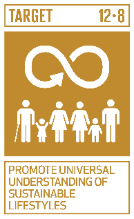

# Ficha Reto 1. Alimentación Km 0

**Autoras:** Ana M.ª Vivar-Quintana, Ana B. Ramos-Gavilán y Ana B. González-Rogado

---

All WE are STEAM  
Retos WE

# FICHA RETO Nº 1 –  
Alimentación Km 0

### Descripción

<a id="_heading=h.gjdgxs"></a>Una alimentación sostenible puede contribuir a cuidar nuestro planeta\. Una alimentación sostenible es la que produce un impacto medioambiental mínimo, siendo económicamente viable y aportando los nutrientes necesarios\. Este reto nos plantea analizar si nuestra alimentación es sostenible evaluando cuántos kilómetros recorre la comida que compramos y comemos\. El transporte de los alimentos no sólo genera emisiones de carbono, sino que también implica un importante desperdicio de alimentos debido a la pérdida por condiciones inadecuadas o tiempos muy largos de transporte y además tiene un coste operativo importante asociado a las fluctuaciones de precio del combustible\.

<a id="_heading=h.hb20jsgai5c5"></a>En este reto sólo será necesario recoger la información de la procedencia de los alimentos que comemos durante una semana para analizar de dónde han venido y cuánto han viajado nuestros alimentos\. Si el reto se aborda de forma conjunta en todo el grupo clase podría analizarse sólo los alimentos de uno o dos días\.

### Enlace al vídeo

```{raw} html
<iframe width="560" height="315" src="https://www.youtube.com/embed/ioA6q12X37k" frameborder="0" allowfullscreen></iframe>
```

```{raw} latex
\begin{center}
\textbf{Video:} \url{https://www.youtube.com/watch?v=ioA6q12X37k}
\end{center}
```

### Nivel educativo recomendado

Esta actividad es adecuada para Educación Primaria o primeros cursos de Educación Secundaria\. Sin embargo, dependiendo del abordaje puede ser perfectamente válida para cursos más altos e incluso Bachillerato\.

### Contenidos a trabajar

Sostenibilidad \(alimentación sostenible\) y Transición ecológica\. Se trabaja el concepto de alimentos Km 0 y se puede aprovechar la actividad para introducir el concepto de huella de carbono de los alimentos\.

### Conocimientos básicos necesarios

No es necesario ningún conocimiento previo\.

### Competencias transversales a desarrollar

- Creatividad y originalidad
- Autonomía e iniciativa personal

### Materiales o recursos necesarios

Solo es necesario disponer de las etiquetas de los alimentos, pero estas también pueden ser encontradas en internet si no disponemos de ellas físicamente\.

### Otros materiales que se pueden utilizar

- Podcast: Insectos, algas y alimentos 3D: la base futura de una alimentación sostenible
```{raw} html
<iframe width="560" height="315" src="https://www.youtube.com/embed/RxkNRgJG46c" frameborder="0" allowfullscreen></iframe>
```

```{raw} latex
\begin{center}
\textbf{Video:} \url{https://www.youtube.com/watch?v=RxkNRgJG46c}
\end{center}
```
- Alimentación sostenible\-Ideas que cambian la vida\.
```{raw} html
<iframe width="560" height="315" src="https://www.youtube.com/embed/vVZ8s7Zkdlg" frameborder="0" allowfullscreen></iframe>
```

```{raw} latex
\begin{center}
\textbf{Video:} \url{https://www.youtube.com/watch?v=vVZ8s7Zkdlg}
\end{center}
```
- EduCaixa TV\. Alimentación, salud y medio ambiente\.
```{raw} html
<iframe width="560" height="315" src="https://www.youtube.com/embed/tb0m9hsUgCo" frameborder="0" allowfullscreen></iframe>
```

```{raw} latex
\begin{center}
\textbf{Video:} \url{https://www.youtube.com/watch?v=tb0m9hsUgCo}
\end{center}
```
- FAO\- Alimentación y agricultura sostenibles \(en inglés con subtítulos\)\.
```{raw} html
<iframe width="560" height="315" src="https://www.youtube.com/embed/R1tXQtU8iVw" frameborder="0" allowfullscreen></iframe>
```

```{raw} latex
\begin{center}
\textbf{Video:} \url{https://www.youtube.com/watch?v=R1tXQtU8iVw}
\end{center}
```
- UN Environment Programme¿Por qué debemos cambiar nuestro sistema alimentario?
```{raw} html
<iframe width="560" height="315" src="https://www.youtube.com/embed/whdONynDB9w" frameborder="0" allowfullscreen></iframe>
```

```{raw} latex
\begin{center}
\textbf{Video:} \url{https://www.youtube.com/watch?v=whdONynDB9w}
\end{center}
```

### Relación con la Agenda 2030

Con este reto se pretende concienciar sobre cómo con una formación STEAM se colabora en la consecución del ODS 12: Producción y Consumo Responsables, en la meta:



Meta 12\.8: De aquí a 2030, asegurar que las personas de todo el mundo tengan la información y los conocimientos pertinentes para el desarrollo sostenible y los estilos de vida en armonía con la naturaleza\.

A través de la página [https://ingenieriaparaods\.usal\.es](https://ingenieriaparaods.usal.es) se puede acceder a material didáctico que facilita el análisis de la situación mundial en relación con los ODS, y permite visibilizar cómo la ingeniería hace posible avanzar en algunas metas\.

### Aspectos que se deben tener en cuenta en la realización del reto

Sería una buena oportunidad para abordar el concepto de alimentación sostenible desde el punto de vista del impacto ambiental de lo que consumimos y el respeto a la biodiversidad\.

<a id="_heading=h.30j0zll"></a>Para estudiantes de cursos superiores, también se puede relacionar con una alimentación saludable y equilibrada introduciendo los conceptos de *slow food*, *raw food*, dieta flexitariana, etc\.

### Otras indicaciones

Al ser un tema sencillo, sin vocabulario muy técnico, se puede desarrollar también en otras lenguas\.

## Agradecimiento

El Ministerio de Igualdad del Gobierno de España, a través del Instituto de las Mujeres financia la actuación RETOS WE, convocatoria PAC 2023 INMUJERES, “All WE are STEAM – Experiencias de aprendizaje planteadas por mujeres ingenieras \(Women Engineers\)”, número de referencia: 31\-4ACT/23\.

