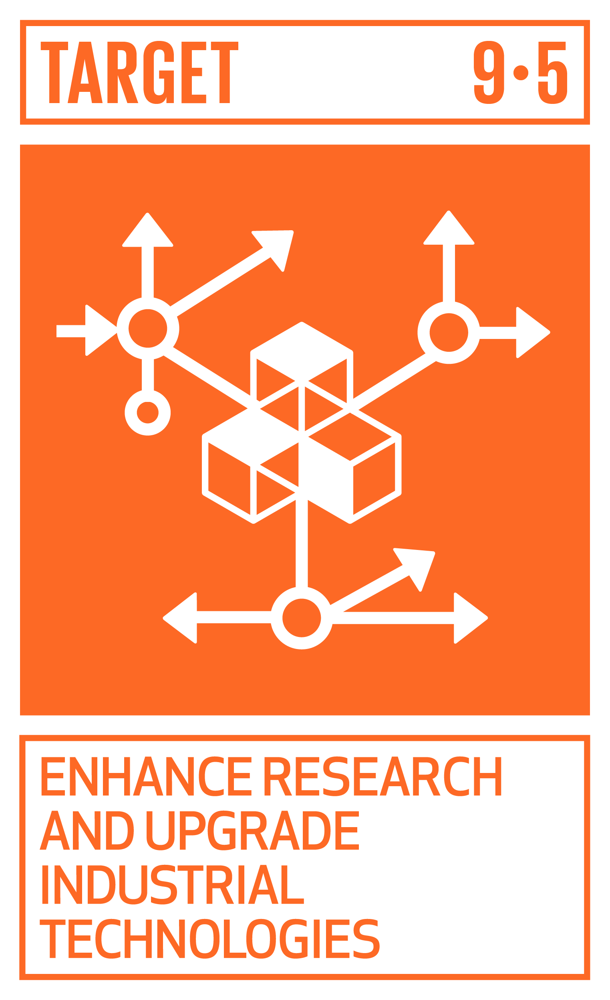

# Ficha Reto 2. Equilibrio de figuras planas

**Autoras:** Ana B. Ramos-Gavilán, Ana M.ª Vivar-Quintana y Ana B. González-Rogado

---

All WE are STEAM  
RETOS WE

# FICHA RETO Nº 2 – Equilibrio de figuras planas

### Descripción

La primera parte de este reto consiste analizar diferentes posiciones de equilibrio de figuras simétricas sencillas\. Para ello, se construirán tres figuras simétricas con cartón reciclado: un círculo, un triángulo y un rectángulo; y se observará su disposición cuando se cuelgan por un punto a la pared\. Los distintos grupos anotarán las conclusiones de la observación, que compartirán con toda la clase\. Se valorará la calidad y estética de las figuras, la presentación de las ideas y la claridad de las conclusiones obtenidas\.

Posteriormente se construirá una figura con cartón reciclado, lo más original posible, cuyo contorno tenga tramos entrantes, salientes, curvos, trazados a mano, etc\. Una vez construida la figura, deberán analizar distintas posiciones de equilibrio y localizar su centro de gravedad en base a la observación previa\. 

Para verificar que el punto que creen es realmente el centro de gravedad de la figura, deberán colocarla en posición horizontal sobre ese punto\. Para ello deberán construir una base que permita el contacto en un único punto, utilizando materiales reciclados disponibles en el centro educativo o en casa\.

La segunda parte del reto consiste en crear una figura que no pueda colocarse en posición horizontal\. Los grupos deberán analizar las razones de esta imposibilidad antes de su construcción\. Una vez construida, se valorarán las ideas ingeniosas que permitirían colocarla en horizontal a pesar de su forma\.

### Enlace al vídeo

```{raw} html
<iframe width="560" height="315" src="https://www.youtube.com/embed/MTtVr5df8bI" frameborder="0" allowfullscreen></iframe>
```

```{raw} latex
\begin{center}
\textbf{Video:} \url{https://www.youtube.com/watch?v=MTtVr5df8bI}
\end{center}
```

### Nivel educativo recomendado

Educación Primaria y Educación Secundaria

### Contenidos a trabajar

- Las fuerzas y sus efectos\.
- Metodologías de la investigación científica y trabajo experimental\.

### Conocimientos básicos necesarios

No son necesarios conocimientos básicos\.

### Competencias a desarrollar

- Utilizar el pensamiento científico para entender y explicar algunos de los fenómenos que ocurren a su alrededor, planteándose preguntas y realizando experimentos sencillos de forma guiada\.
- Crear contenidos digitales en distintos formatos \(texto, imagen, vídeo,\.\.\.\) mediante el uso de diferentes herramientas digitales para expresar ideas y conocimientos, respetando la propiedad intelectual y los derechos de autor de los contenidos que reutiliza\.

### Elementos transversales

- Expresión oral y escrita\.
- Comunicación audiovisual y TIC\.
- Fomento de la creatividad y del espíritu científico\.

### Materiales o recursos necesarios

Los materiales necesarios será cartón para construir las figuras, y los elementos con los que construyan la base\. En todo caso serán reciclados\.

### Otros materiales que se pueden utilizar

```{raw} html
<iframe width="560" height="315" src="https://www.youtube.com/embed/vTLN3sAEzPM" frameborder="0" allowfullscreen></iframe>
```

```{raw} latex
\begin{center}
\textbf{Video:} \url{https://www.youtube.com/watch?v=vTLN3sAEzPM}
\end{center}
```

Primaria: 

```{raw} html
<iframe width="560" height="315" src="https://www.youtube.com/embed/OWXIO0sgcGE" frameborder="0" allowfullscreen></iframe>
```

```{raw} latex
\begin{center}
\textbf{Video:} \url{https://www.youtube.com/watch?v=OWXIO0sgcGE}
\end{center}
```
```{raw} html
<iframe width="560" height="315" src="https://www.youtube.com/embed/lOoM3neHrug" frameborder="0" allowfullscreen></iframe>
```

```{raw} latex
\begin{center}
\textbf{Video:} \url{https://www.youtube.com/watch?v=lOoM3neHrug}
\end{center}
```

Secundaria: 

```{raw} html
<iframe width="560" height="315" src="https://www.youtube.com/embed/rUuHlNIZfn8" frameborder="0" allowfullscreen></iframe>
```

```{raw} latex
\begin{center}
\textbf{Video:} \url{https://www.youtube.com/watch?v=rUuHlNIZfn8}
\end{center}
```
```{raw} html
<iframe width="560" height="315" src="https://www.youtube.com/embed/xM9rZj2qQkc" frameborder="0" allowfullscreen></iframe>
```

```{raw} latex
\begin{center}
\textbf{Video:} \url{https://www.youtube.com/watch?v=xM9rZj2qQkc}
\end{center}
```
```{raw} html
<iframe width="560" height="315" src="https://www.youtube.com/embed/-gAtSXieNJs" frameborder="0" allowfullscreen></iframe>
```

```{raw} latex
\begin{center}
\textbf{Video:} \url{https://www.youtube.com/watch?v=-gAtSXieNJs}
\end{center}
```

### Relación con la Agenda 2030

Con este reto se pretende concienciar sobre cómo con una formación STEAM se colabora en la consecución del ODS 9: Industria, Innovación e Infraestructura; y del ODS 12: Producción y Consumo responsables; en las metas:



Meta 9\.5: Aumentar la investigación científica y mejorar la capacidad tecnológica de los sectores industriales de todos los países, en particular los países en desarrollo, entre otras cosas fomentando la innovación y aumentando considerablemente, de aquí a 2030, el número de personas que trabajan en investigación y desarrollo por millón de habitantes y los gastos de los sectores público y privado en investigación y desarrollo\.


Meta 12\.5: De aquí a 2030, reducir considerablemente la generación de desechos mediante actividades de prevención, reducción, reciclado y reutilización\.

A través de la página [https://ingenieriaparaods\.usal\.es](https://ingenieriaparaods.usal.es) se puede acceder a material didáctico que facilita el análisis de la situación mundial en relación con los ODS, y permite visibilizar cómo la ingeniería hace posible avanzar en algunas metas\.

### Aspectos que se deben tener en cuenta en la realización del reto

El reto no persigue la simple localización del centro de gravedad mediante ensayos de prueba y error, sino que busca fomentar el razonamiento a través del análisis del equilibrio\.

<a id="_heading=h.gjdgxs"></a>Para que el vídeo fuera más vistoso y sencillo de rodar, se emplearon cartulinas de colores\. Para el reto se pide el empleo de cartón\.

### Otras indicaciones

Si la asignatura en que se plantea forma parte del programa bilingüe, se recomienda que las explicaciones y conclusiones se realicen en el idioma correspondiente\.

## Agradecimiento

El Ministerio de Igualdad del Gobierno de España, a través del Instituto de las Mujeres financia la actuación RETOS WE, convocatoria PAC 2023 INMUJERES, “All WE are STEAM – Experiencias de aprendizaje planteadas por mujeres ingenieras \(Women Engineers\)”, número de referencia: 31\-4ACT/23\.

