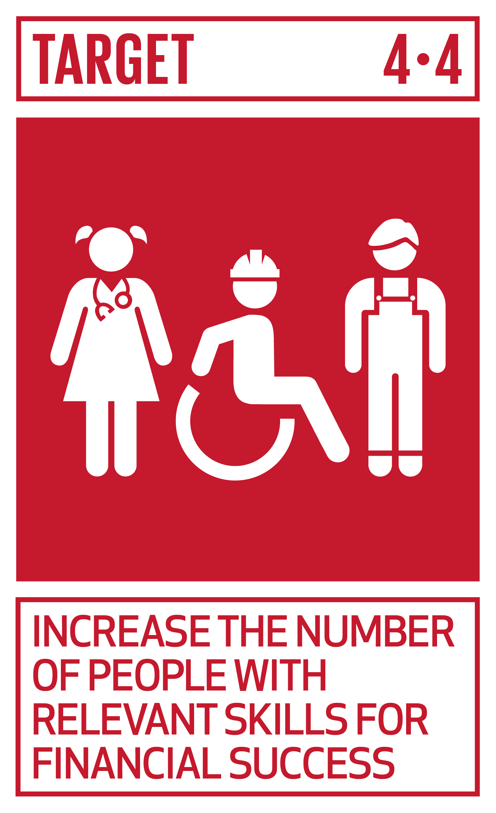
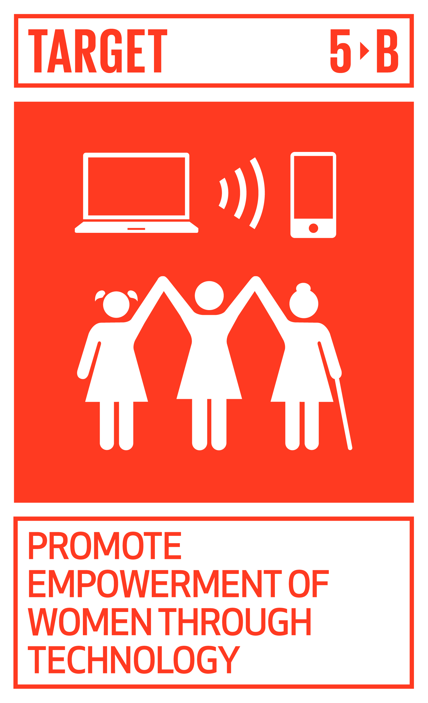
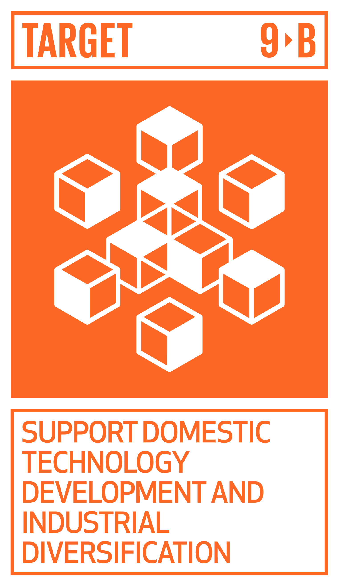

# Ficha Reto 3. Algoritmos Culinarios

**Autoras:** Ana B. González-Rogado, Ana M.ª Vivar-Quintana y Ana B. Ramos-Gavilán

---

ALL WE are STEAM  
RETOS WE

# FICHA RETO Nº 3 – Algoritmos Culinarios

### Descripción

Como usuarios y usuarias estamos acostumbrados a hablar a nuestros dispositivos electrónicos para solicitar información\. Son las programadoras y los programadores quienes hacen eso posible, utilizando lenguajes que entienden los ordenadores\. Escribir en esos lenguajes se denomina programar y para programar hay que diseñar algoritmos\. El reto busca familiarizar al alumnado con el pensamiento computacional, transformando recetas de cocina en recetas computacionales que utilicen algoritmos culinarios\.

Combinar conocimientos culinarios con pensamiento algorítmico ofrece una perspectiva creativa y práctica para aprender y aplicar conceptos de programación, con la finalidad de\.

- Desarrollar habilidades de pensamiento computacional, incluyendo la capacidad de descomponer un problema en pasos más pequeños\.
- Practicar la lógica y el razonamiento al crear una secuencia de pasos para completar una tarea\.
- Fortalecer la habilidad para contar una historia de manera consistente y clara en secuencias de pasos\.
- Aprender a expresar la creatividad mediante la personalización de las recetas

### Enlace al vídeo

```{raw} html
<iframe width="560" height="315" src="https://www.youtube.com/embed/BIJVdrh887I" frameborder="0" allowfullscreen></iframe>
```

```{raw} latex
\begin{center}
\textbf{Video:} \url{https://www.youtube.com/watch?v=BIJVdrh887I}
\end{center}
```

### Nivel educativo recomendado

El reto puede adaptarse a cualquier nivel educativo, ya que puede afrontarse con lenguaje natural para Primaria, ESO o FP básico, o con pseudocódigo para Bachillerato o FP Medio\.

### Contenidos a trabajar

1. __Pensamiento Algorítmico__: Desarrollo de la capacidad para pensar en términos de pasos secuenciales y lógicos necesarios para llevar a cabo una tarea específica, en este caso, cocinar una receta\.
2. __Estructuras de Control__: Utilización de estructuras de control como bucles \(por ejemplo, mezclar ingredientes hasta obtener una consistencia específica\) y condicionales \(por ejemplo, ajustar el tiempo de cocción dependiendo del tamaño del plato\)\.
3. __Abstracción__: Identificación y descripción de los pasos esenciales para preparar una receta, lo que implica abstraer detalles no esenciales y centrarse en lo fundamental\.
4. __Funciones y Procedimientos__: La creación de recetas puede compararse con la creación de funciones o procedimientos en programación\. Los estudiantes pueden definir subprocesos para tareas comunes, como preparar una salsa, y luego llamar a esos subprocesos en la receta principal\.
5. __Variables__: La manipulación de ingredientes y la adaptación de cantidades puede introducir el concepto de variables, donde los valores pueden cambiar en diferentes contextos\.
6. __Optimización__ y Eficiencia: Consideración de cómo optimizar el proceso de cocina, eliminando pasos innecesarios o reduciendo el tiempo de preparación, reflejando el concepto de optimización en programación\.
7. __Resolución de Problemas__: Anticipación y solución de problemas que podrían surgir durante la preparación de la receta, fomentando habilidades de resolución de problemas en tiempo real\.
8. __Licencias Creative Commons\.__ Presentación de este tipo de licencias que permiten compartir, copiar, redistribuir y adaptar el material en cualquier medio o formato, atribuyendo las fuentes\. 

### Conocimientos básicos necesarios

Ninguno\.

### Competencias transversales a desarrollar

1. __Comunicación Clara__: Desarrollo de habilidades de comunicación escrita y hablada para expresar de manera clara y precisa cada paso de la receta, similar a la importancia de la documentación en programación\.
2. __Creatividad e Innovación__: La creación de nuevas recetas o la adaptación de recetas existentes fomenta la creatividad y la innovación, aspectos esenciales en el mundo de la programación y la cocina\.
3. __Trabajo en Equipo__: Si se realiza en grupo, los estudiantes pueden aprender a colaborar, combinar habilidades y debatir sobre la mejor manera de abordar el diseño de la receta computacional\.

### Materiales o recursos necesarios

Solo es necesario utilizar lápices, Bolígrafos o dispositivos electrónicos y hojas de trabajo o plantillas\.

### Otros materiales que se pueden utilizar

- Cuadernillos digitales de pensamiento computacional: https://campusvirtual\.ull\.es/ocw/course/view\.php?id=153
- Computer Science Unplugged: [https://www\.csunplugged\.org/es/](https://www.csunplugged.org/es/)
- La educación en el pensamiento computacional: ¿cómo enseñar a los alumnos a pensar de manera algorítmica y lógica?: [https://www\.tekmaneducation\.com/pensamiento\-computacional/](https://www.tekmaneducation.com/pensamiento-computacional/) 
- Licencias Creative Commons \(CC BY 4\.0 DEED\. Atribución 4\.0 Internacional\): [https://creativecommons\.org/licenses/by/4\.0/deed\.es](https://creativecommons.org/licenses/by/4.0/deed.es) 

### Relación con la Agenda 2030

Con este reto se pretende concienciar sobre cómo con una formación STEAM se colabora en la consecución del ODS 4: Educación de calidad; del ODS 5: Igualdad de género; y del ODS 9\. Industria, innovación e infraestructuras; en las metas:



Meta 4\.4\. Aumento de las competencias para acceder al empleo\.



Meta 5\.B\. Mejorar el uso de tecnología y TIC\.



Meta 9\.B\. Desarrollo de la tecnología, investigación e innovación\.

A través de la página [https://ingenieriaparaods\.usal\.es](https://ingenieriaparaods.usal.es) se puede acceder a material didáctico que facilita el análisis de la situación mundial en relación con los ODS, y permite visibilizar cómo la ingeniería lo hace posible avanzar en algunas metas\.

### Aspectos que se deben tener en cuenta en la realización del reto

Esta actividad interdisciplinaria puede ser adaptada para afrontar múltiples objetivos educativos, así como para conocer conceptos de programación en un contexto tangible y cotidiano como la cocina\. Se recomienda adaptar los materiales según la edad y habilidades de los y las estudiantes, así como los recursos disponibles en el entorno educativo\. La idea es hacer que la actividad sea accesible y significativa para quienes participan\.

### Otras indicaciones

Ninguna\.

## Agradecimiento

El Ministerio de Igualdad del Gobierno de España, a través del Instituto de las Mujeres financia la actuación RETOS WE, convocatoria PAC 2023 INMUJERES, “All WE are STEAM – Experiencias de aprendizaje planteadas por mujeres ingenieras \(Women Engineers\)”, número de referencia: 31\-4ACT/23\.

