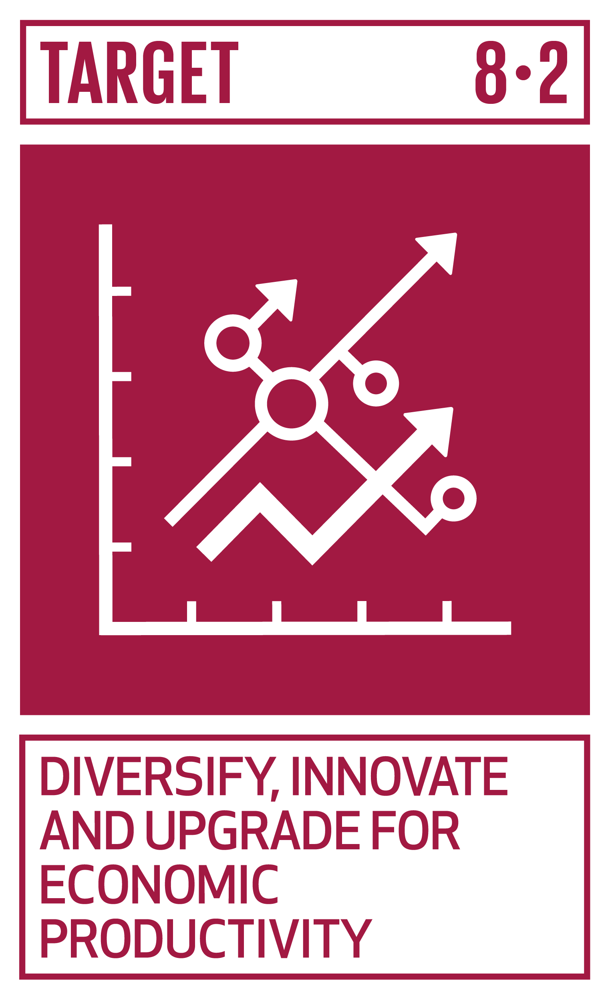
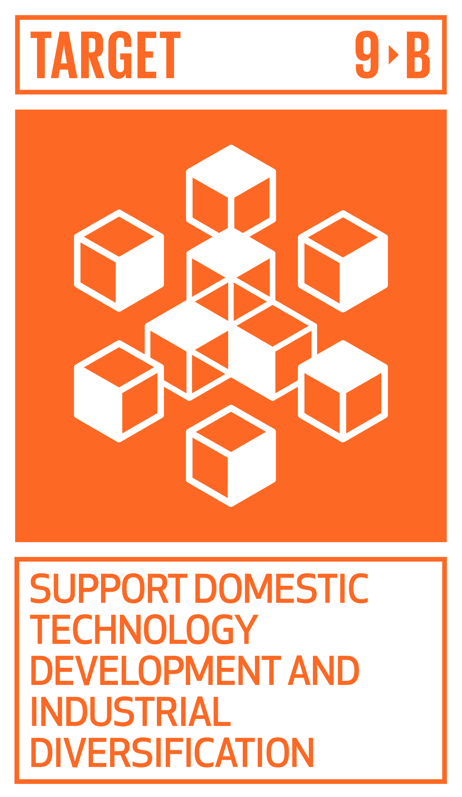
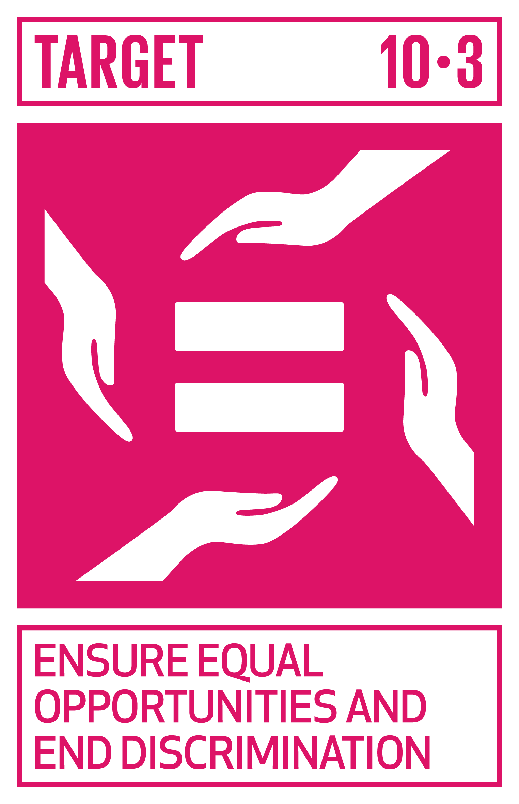
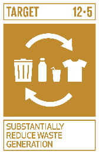

# Ficha Reto 4. Create the lever you need

**Autoras:** Débora Rodrigues, Ana B. Ramos-Gavilán, Ana M.ª Vivar-Quintana y Ana B. González-Rogado

---

All WE are STEAM  
RETOS WE

# FICHA RETO Nº 4 – Create the lever you need

### Descripción

El reto consiste en crear una nueva máquina simple basada en la palanca\. Para ello, los alumnos y alumnas deberán identificar una necesidad que pueda ser abordada mediante esta herramienta, definiendo la configuración que mejor se adapta de las tres descritas en el vídeo\. 

Una vez elegida la clase de palanca, los grupos abordarán su diseño y construcción\. El prototipo de la máquina se elaborará empleando materiales reciclados\. 

En la presentación, los grupos deberán explicar detalladamente el avance tecnológico de su solución, la configuración elegida para la palanca y la elección de materiales, los detalles del diseño más importantes, así como las dificultades y su resolución\. 

Se valorará la utilidad de la máquina diseñada, su correcto funcionamiento y originalidad\. 

### Enlace al vídeo

```{raw} html
<iframe width="560" height="315" src="https://www.youtube.com/embed/GKNZ6eJr-7I" frameborder="0" allowfullscreen></iframe>
```

```{raw} latex
\begin{center}
\textbf{Video:} \url{https://www.youtube.com/watch?v=GKNZ6eJr-7I}
\end{center}
```

### Nivel educativo recomendado

Educación Primaria y Educación Secundaria

### Contenidos a trabajar

- Propiedades de las máquinas simples y su efecto sobre las fuerzas\. Aplicaciones y usos en la vida cotidiana\. 
- Estructuras para la construcción de modelos\.
- Emprendimiento, perseverancia y creatividad en la resolución de problemas\.

### Conocimientos básicos necesarios

No son necesarios conocimientos básicos\.

### Competencias a desarrollar

- Realiza proyectos, diseñando, fabricando y evaluando diferentes prototipos o modelos, adaptándose para generar en equipo un producto creativo\.
- Crear contenidos digitales en distintos formatos \(texto, imagen, vídeo,\.\.\.\) mediante el uso de diferentes herramientas digitales para expresar ideas y conocimientos, respetando la propiedad intelectual y los derechos de autor de los contenidos que reutiliza\.
- Usar una lengua, además de la familiar, para responder a necesidades comunicativas de manera adecuada en contextos cotidianos\.

### Elementos transversales

- Expresión oral y escrita\.
- Comunicación audiovisual y TIC\.
- Fomento de la creatividad y del espíritu científico\.

### Materiales o recursos necesarios

Los materiales necesarios para construir el prototipo serán reciclados\.

### Otros materiales que se pueden utilizar

```{raw} html
<iframe width="560" height="315" src="https://www.youtube.com/embed/MWHRVnQ9O4I" frameborder="0" allowfullscreen></iframe>
```

```{raw} latex
\begin{center}
\textbf{Video:} \url{https://www.youtube.com/watch?v=MWHRVnQ9O4I}
\end{center}
```

Primaria: 

```{raw} html
<iframe width="560" height="315" src="https://www.youtube.com/embed/F5lFXhO84wM" frameborder="0" allowfullscreen></iframe>
```

```{raw} latex
\begin{center}
\textbf{Video:} \url{https://www.youtube.com/watch?v=F5lFXhO84wM}
\end{center}
```

Secundaria: 

- [https://recursos\.edu\.xunta\.gal/sites/default/files/recurso/1464947673/21\_la\_palanca\.html](https://recursos.edu.xunta.gal/sites/default/files/recurso/1464947673/21_la_palanca.html)

### <a id="_heading=h.nwe9k1y6wj9y"></a>Relación con la Agenda 2030 

Con este reto se pretende concienciar sobre cómo con una formación STEAM se colabora en la consecución del ODS 8: Trabajo decente y crecimiento económico; del ODS 9: Industria, innovación e infraestructura; del ODS 10: Reducción de las desigualdades; y del ODS 12: Producción y consumo responsables; en las metas:



Meta 8\.2: Elevar la productividad a través de la diversificación, tecnología e innovación\.



Meta 9\.B: Desarrollo de la tecnología, investigación e innovación\.



Meta 10\.3: Garantizar la igualdad de oportunidades\.



Meta 12\.5: Prevención, reducción, reciclado y reutilización de desechos\.

A través de la página [https://ingenieriaparaods\.usal\.es](https://ingenieriaparaods.usal.es) se puede acceder a material didáctico que facilita el análisis de la situación mundial en relación con los ODS, y permite visibilizar cómo la ingeniería hace posible avanzar en algunas metas\.

### Aspectos que se deben tener en cuenta en la realización del reto

Este reto es una oportunidad para llevar a cabo un aprendizaje basado en el diseño\. La creación del prototipo exige identificar necesidades, generar alternativas y seleccionar una\.

### Otras indicaciones

Es importante que el docente fomente la creatividad, animando a la generación de ideas creativas y soluciones innovadoras, transmitiendo coraje para explorar y pensar fuera de lo convencional\.

## Agradecimiento

<a id="_heading=h.gjdgxs"></a>El Ministerio de Igualdad del Gobierno de España, a través del Instituto de las Mujeres financia la actuación RETOS WE, convocatoria PAC 2023 INMUJERES, “All WE are STEAM – Experiencias de aprendizaje planteadas por mujeres ingenieras \(Women Engineers\)”, número de referencia: 31\-4ACT/23\.

