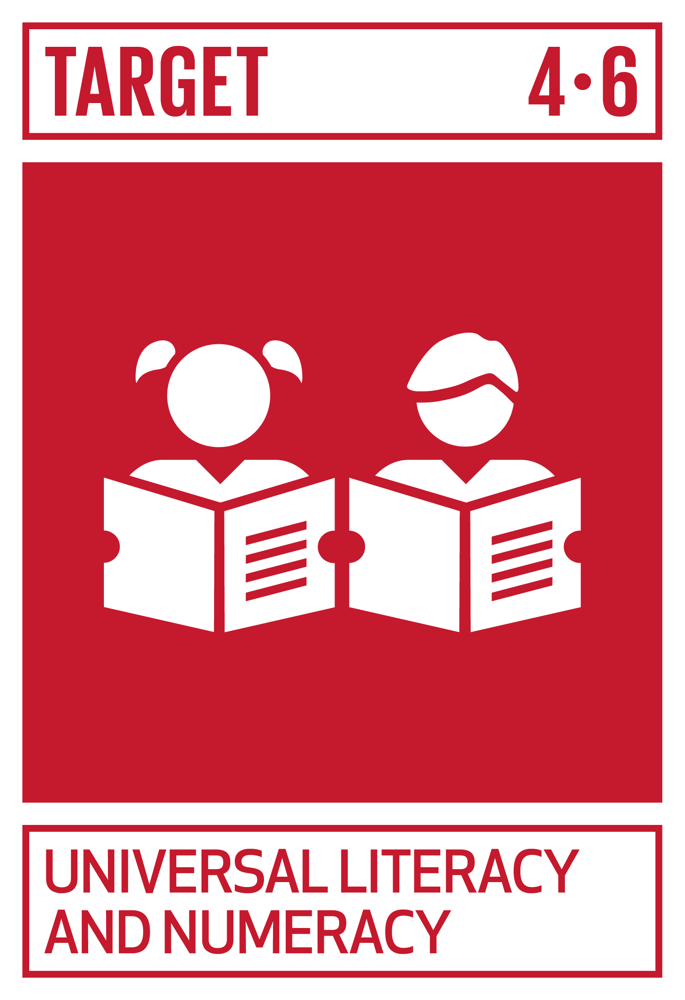
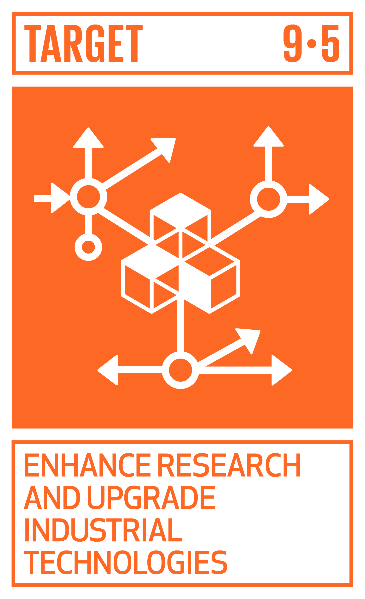
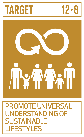

# Ficha Reto 6. El "Slime" de las carreteras

**Autoras:** Diana Movilla-Quesada, Ana B. Ramos-Gavilán, Ana M.ª Vivar-Quintana y Ana B. González-Rogado

---

All WE are STEAM  
RETOS WE

# FICHA RETO Nº 6 – El “Slime” de las carreteras

### Descripción

Las carreteras están construidas con áridos \(procedentes de rocas\) y betunes \(procedentes del petróleo\)\. Este segundo material \(betún\), es una pieza fundamental para que la superficie de la carretera se mantenga “pegada”, sin que se produzca un levantamiento del material por el paso de los vehículos\. Sin embargo, el betún es un material un poco “especial”, ya que se puede clasificar como un “fluido no newtoniano”\. ¿Y qué quiere decir “fluido no newtoniano? Es fácil, cuando aplicamos una fuerza sobre el fluido éste se comporta como un sólido, ya que las partículas se enredan formando “redes” porque no tienen tiempo a organizarse y su viscosidad aumenta\. Mientras que si no aplicamos ninguna fuerza este material se comporta como un líquido, ya que sus partículas no se ordenan y su viscosidad baja\. 

¿Y hay alguna forma de saber si realmente este material es un “fluido no newtoniano”? ¡Sí, y este es el RETO\! En un bol se debe colocar una cantidad de almidón de maíz \(lo cual es similar al betún\) y añadir agua\. Es importante fijar muy bien las cantidades, ya que siempre el almidón debe ser el doble que la cantidad de agua\. Si lo prefieres, se puede colocar un colorante negro para que se parezca al betún que utilizamos en las carreteras\. Removemos la mezcla durante un rato y obtenemos la mezcla homogénea\. ¿Y ahora qué pasa? Al aplicar una fuerza a la mezcla el fluido actuará como un sólido, mientras que si no le aplica ninguna fuerza actuará como un líquido\.

### Enlace al vídeo

```{raw} html
<iframe width="560" height="315" src="https://www.youtube.com/embed/15gxkxF-Tvc" frameborder="0" allowfullscreen></iframe>
```

```{raw} latex
\begin{center}
\textbf{Video:} \url{https://www.youtube.com/watch?v=15gxkxF-Tvc}
\end{center}
```

### Nivel educativo recomendado

Esta actividad es adecuada para Educación Primaria y primeros cursos de Educación Secundaria\. Sin embargo, dependiendo del abordaje puede ser perfectamente válida para cursos más altos e incluso bachillerato\.

### Contenidos a trabajar

Materiales y física\. 

### Conocimientos básicos necesarios

No es necesario ningún conocimiento previo\.

### Competencias transversales a desarrollar

- Autonomía e iniciativa personal\.
- Competencia en el conocimiento y la interacción con el mundo físico\.
- Competencia para aprender a aprender\.

### Materiales o recursos necesarios

- 1 bol o recipiente
- 1 tazas de maicena \(almidón de maíz\)
- 1 Colorante
- ½ vaso de agua
- 1 cuchara

### Otros materiales que se pueden utilizar

- PODCAST: Porque lo físico también es lo importante” [https://www\.ivoox\.com/e41\-fluidos\-no\-newtonianos\-audios\-mp3\_rf\_19654600\_1\.html](https://www.ivoox.com/e41-fluidos-no-newtonianos-audios-mp3_rf_19654600_1.html)
- El secreto de los líquidos que no son líquidos [https://www\.cienciacanaria\.es/secciones/a\-fondo/573\-el\-secreto\-de\-los\-liquidos\-que\-no\-son\-liquidos](https://www.cienciacanaria.es/secciones/a-fondo/573-el-secreto-de-los-liquidos-que-no-son-liquidos)

### Relación con la Agenda 2030

Con este reto se pretende concienciar sobre cómo con una formación STEAM se colabora en la consecución del ODS 4: Educación de calidad; del ODS 9: Industria, innovación e infraestructura; y del ODS12: Producción y consumo responsables; en las metas:



Meta 4\.6: De aquí a 2030, asegurar que todos los jóvenes y una proporción considerable de los adultos, tanto hombres como mujeres, estén alfabetizados y tengan nociones elementales de aritmética\.



Meta 9\.5: Aumentar la investigación científica y mejorar la capacidad tecnológica de los sectores industriales de todos los países\.



Meta 12\.8: De aquí a 2030, asegurar que las personas de todo el mundo tengan la información y los conocimientos pertinentes para el desarrollo sostenible y los estilos de vida en armonía con la naturaleza\.

A través de la página [https://ingenieriaparaods\.usal\.es](https://ingenieriaparaods.usal.es) se puede acceder a material didáctico que facilita el análisis de la situación mundial en relación con los ODS, y permite visibilizar cómo la ingeniería hace posible avanzar en algunas metas\.

### Aspectos que se deben tener en cuenta en la realización del reto

Sería una buena oportunidad para abordar el concepto de la materia y sus estados, estableciendo que la energía puede ser un agente de cambio en las propiedades de la materia \(sostenibilidad\)\. 

Para alumnos de cursos superiores, se puede relacionar con experimentos más complejos, utilizando por ejemplo aceites, yesos, etc\. para sus posibles aplicaciones en el ámbito de la construcción\.

### Otras indicaciones

Es un tema que puede aplicarse no sólo al ámbito de la ingeniería civil, sino a otros ámbitos\.

## Agradecimiento

El Ministerio de Igualdad del Gobierno de España, a través del Instituto de las Mujeres financia la actuación RETOS WE, convocatoria PAC 2023 INMUJERES, “All WE are STEAM – Experiencias de aprendizaje planteadas por mujeres ingenieras \(Women Engineers\)”, número de referencia: 31\-4ACT/23\.

