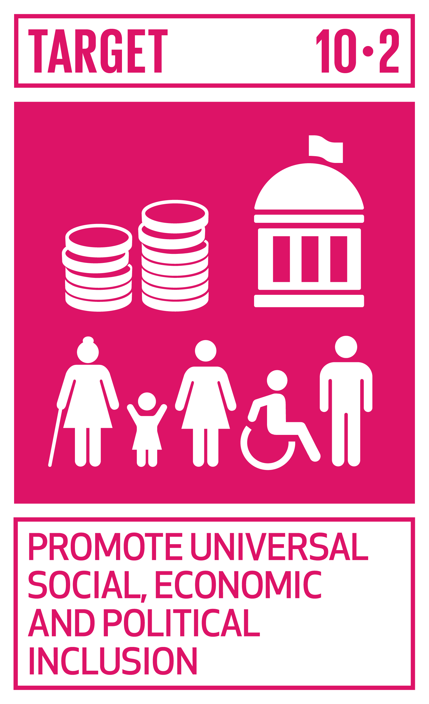

# Ficha Reto 8. Apps accesibles

**Autoras:** Alicia García-Holgado, Ana B. Ramos-Gavilán, Ana M.ª Vivar-Quintana y Ana B. González-Rogado

---

All WE are STEAM  
RETOS WE

# FICHA RETO Nº 8 – Apps accesibles

### Descripción

<a id="_heading=h.gjdgxs"></a>El reto consiste en crear una aplicación interactiva con *Scratch Lab Face Sensing* y la extensión de Lápiz, permitiendo a los usuarios dibujar usando solo movimientos de la cabeza\. Los participantes deben diseñar la interfaz para que sea intuitiva y accesible, teniendo en cuenta a usuarios con distintas capacidades\. Finalmente, se evalúa y mejora la aplicación a través de pruebas prácticas con compañeros y compañeras, enfocándose en la usabilidad y accesibilidad del diseño\.

### Enlace al vídeo

```{raw} html
<iframe width="560" height="315" src="https://www.youtube.com/embed/jZYaIQhQ9w0" frameborder="0" allowfullscreen></iframe>
```

```{raw} latex
\begin{center}
\textbf{Video:} \url{https://www.youtube.com/watch?v=jZYaIQhQ9w0}
\end{center}
```

### Nivel educativo recomendado

Esta actividad es adecuada para Educación Primaria o primeros cursos de Educación Secundaria\. Sin embargo, dependiendo del abordaje puede ser perfectamente válida para cursos más altos e incluso Bachillerato\.

### Contenidos a trabajar

Los estudiantes desarrollarán habilidades técnicas en programación visual y reconocimiento facial, fomentando la creatividad y el diseño innovador\. Este proyecto enfrenta desafíos de programación y usabilidad\. Además, inculca una conciencia importante sobre la accesibilidad y la inclusión en la tecnología\. 

### Conocimientos básicos necesarios

No es necesario ningún conocimiento previo, tan solo una mínima competencia digital\.

### Competencias transversales a desarrollar

- Pensamiento crítico y resolución de problemas: Durante la creación de la aplicación, los participantes deben pensar de manera crítica para diseñar una interfaz que sea intuitiva y accesible\. Además, deben resolver problemas técnicos y de diseño que surjan durante el desarrollo\.
- Creatividad e Innovación: Uso de ideas originales para controlar la aplicación mediante movimientos de la cabeza\.
- Competencias Digitales: Mejora de habilidades en programación y uso de tecnologías interactivas con Scratch\.
- Comunicación y Colaboración: Trabajo en equipo y comunicación efectiva durante las pruebas con usuarios\.
- Empatía: Consideración de usuarios con diferentes capacidades para crear una aplicación accesible\.

### Materiales o recursos necesarios

Es necesario un ordenador para poder realizar el proyecto\. Además, para poder probar la aplicación desarrollada se necesita una webcam en el ordenador o visualizar el proyecto en un móvil o *tablet* en el que funcione la cámara delantera\.

Utiliza Scratch Lab Face Sensing [https://lab\.scratch\.mit\.edu/face/](https://lab.scratch.mit.edu/face/) para crear el proyecto y añade la extensión Lápiz para poder utilizar los bloques Scratch que permiten dibujar\.

 

### Otros materiales que se pueden utilizar

- Se pueden utilizar otras herramientas para grabar sonidos o crear imágenes que se integren en la aplicación\.

### Relación con la Agenda 2030

Con este reto se pretende concienciar sobre cómo con una formación STEAM se colabora en la consecución del ODS 10: Reducir la desigualdad en y entre los países, en la meta:



Meta 10\.2: De aquí a 2030, potenciar y promover la inclusión social, económica y política de todas las personas, independientemente de su edad, sexo, discapacidad, raza, etnia, origen, religión o situación económica u otra condición\.

A través de la página [https://ingenieriaparaods\.usal\.es](https://ingenieriaparaods.usal.es) se puede acceder a material didáctico que facilita el análisis de la situación mundial en relación con los ODS, y permite visibilizar cómo la ingeniería hace posible avanzar en algunas metas\.

### Aspectos que se deben tener en cuenta en la realización del reto

Es crucial animar al alumnado a considerar cómo sus creaciones pueden ser accesibles y disfrutadas por usuarios con diferentes capacidades, y ofrecer retroalimentación continua para guiar su aprendizaje y desarrollo creativo\.

Para familiarizarse con la herramienta, en la parte inferior de la web de *Scratch Lab Face Sensing* hay tres proyectos guiados que sirven para explorar su uso\.

Una vez hayan creado la primera versión de su proyecto, deben probarlo con otros compañeros y compañeras con el fin de validar el funcionamiento y mejorarlo\. 

### Otras indicaciones

Al ser un tema sencillo, sin vocabulario muy técnico, se puede desarrollar también en otras lenguas\. Por ejemplo, las pruebas de la aplicación con usuarios pueden realizarse en inglés\.

## Agradecimiento

El Ministerio de Igualdad del Gobierno de España, a través del Instituto de las Mujeres financia la actuación RETOS WE, convocatoria PAC 2023 INMUJERES, “All WE are STEAM – Experiencias de aprendizaje planteadas por mujeres ingenieras \(Women Engineers\)”, número de referencia: 31\-4ACT/23\.

