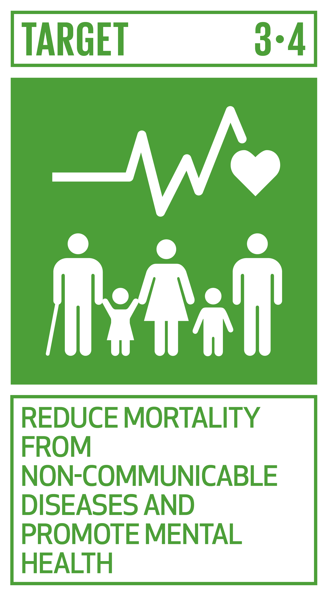
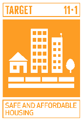

# Ficha Reto 9. ¿Podemos medir el confort de nuestra vivienda?

**Autoras:** M. Almudena Frechilla-Alonso, Ana B. Ramos-Gavilán, Ana M.ª Vivar-Quintana y Ana B. González-Rogado

---

All WE are STEAM  
RETOS WE

# FICHA RETO Nº 9 – ¿Podemos medir el confort de nuestra vivienda?

### Descripción

Los requisitos de habitabilidad tienen como objetivo conformar espacios seguros, confortables y sanos para las personas\. Este reto nos invita a reflexionar sobre cómo influye el entorno doméstico en nuestro bienestar físico y mental, evaluando las condiciones de habitabilidad de las estancias de una vivienda\.

### Enlace al vídeo

```{raw} html
<iframe width="560" height="315" src="https://www.youtube.com/embed/6E_I8auc3-M" frameborder="0" allowfullscreen></iframe>
```

```{raw} latex
\begin{center}
\textbf{Video:} \url{https://www.youtube.com/watch?v=6E_I8auc3-M}
\end{center}
```

### Nivel educativo recomendado

Esta actividad es adecuada para cursos avanzados de Educación Secundaria y para Bachillerato, aunque también puede ser válida para cursos inferiores, siempre y cuando, el personal docente facilite a los estudiantes los datos extraídos de la normativa\.

### Contenidos a trabajar

Habitabilidad, condiciones de bienestar en las viviendas\. Se trabajan los conceptos de dimensiones mínimas de las estancias y superficies de ventilación e iluminación\.

### Conocimientos básicos necesarios

Fracciones, geometría básica \(áreas y volúmenes\), croquización\. 

### Competencias transversales a desarrollar

- Comprensión lectora\.
- Fomento de la creatividad y del espíritu científico\.
- Educación para la salud\.

### Materiales o recursos necesarios

Como medios materiales solo es necesario disponer de una cinta métrica o medidor láser, así como papel y lápiz\. 

Dada la variedad de normativa nacional, autonómica y municipal aplicable a cada caso, para resolver el reto se tomará como referencia las condiciones mínimas de habitabilidad previstas en el documento “Normativa” de la Revisión del Plan General de Ordenación Urbana de Zamora de 2011 \[art\. 72 apartados 1 \(residencial unifamiliar\) y 2 \(residencial colectivo\)\]:

[http://www\.jcyl\.es/plaupdf/49/49275/287106/DR%20\-%20NORMATIVA\.pdf](http://www.jcyl.es/plaupdf/49/49275/287106/DR%20-%20NORMATIVA.pdf)

### Otros materiales que se pueden utilizar

- Condiciones mínimas de habitabilidad

[https://alfonsobruna\.com/2022/02/14/condiciones\-minimas\-de\-una\-vivienda/](https://alfonsobruna.com/2022/02/14/condiciones-minimas-de-una-vivienda/)

- Condiciones de habitabilidad ¿cuáles son?

[https://www\.klicarquitectos\.com/blog/condiciones\-habitabilidad/](https://www.klicarquitectos.com/blog/condiciones-habitabilidad/)

- ¿Cuáles son los requisitos de habitabilidad de una vivienda?

[https://housfy\.com/blog/requisitos\-se\-necesitan\-la\-habitabilidad\-una\-vivienda/](https://housfy.com/blog/requisitos-se-necesitan-la-habitabilidad-una-vivienda/)

- Habitabilidad de una vivienda: concepto y claves

[https://lmingecon\.com/habitabilidad\-de\-vivienda\-concepto\-y\-claves/](https://lmingecon.com/habitabilidad-de-vivienda-concepto-y-claves/)

### Relación con la Agenda 2030

Con este reto se pretende concienciar sobre cómo con una formación STEAM se colabora en la consecución del ODS 3: Garantizar una vida sana y promover el bienestar para todos en todas las edades; y del ODS11: Lograr que las ciudades sean más inclusivas, seguras, resilientes y sostenibles; en las metas:



Meta 3\.4: Para 2030, reducir en un tercio la mortalidad prematura por enfermedades no transmisibles mediante la prevención y el tratamiento y promover la salud mental y el bienestar\.



Meta 11\.1: De aquí a 2030, asegurar el acceso de todas las personas a viviendas y servicios básicos adecuados, seguros y asequibles y mejorar los barrios marginales\.

A través de la página [https://ingenieriaparaods\.usal\.es](https://ingenieriaparaods.usal.es) se puede acceder a material didáctico que facilita el análisis de la situación mundial en relación con los ODS, y permite visibilizar cómo la ingeniería hace posible avanzar en algunas metas\.

### Aspectos que se deben tener en cuenta en la realización del reto

En el actual contexto post pandemia, esta propuesta ofrece la oportunidad de reflexionar sobre el alcance de las actuales condiciones de habitabilidad y el grado de adaptabilidad de nuestras viviendas ante situaciones coyunturales\.

Este intercambio de ideas puede llevar a plantear como actividad complementaria el estudio de posibles mejoras de habitabilidad ante los nuevos hábitos diarios y nuestra propia percepción del confort\.

### Otras indicaciones

No se describen otras indicaciones\.

## Agradecimiento

El Ministerio de Igualdad del Gobierno de España, a través del Instituto de las Mujeres financia la actuación RETOS WE, convocatoria PAC 2023 INMUJERES, “All WE are STEAM – Experiencias de aprendizaje planteadas por mujeres ingenieras \(Women Engineers\)”, número de referencia: 31\-4ACT/23\.

