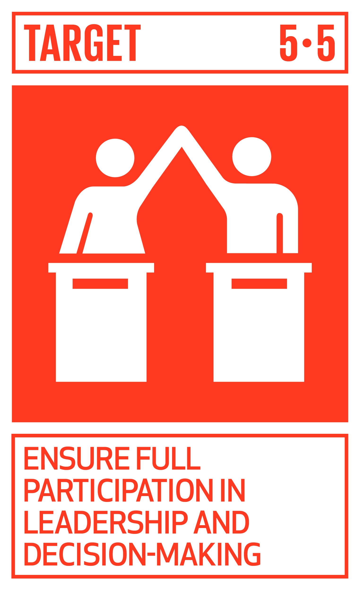

# Ficha Reto 10. Mensajes secretos con disco cifrador

**Autoras:** Susana Nieto-Isidro, Ana B. Ramos-Gavilán, Ana M.ª Vivar-Quintana y Ana B. González-Rogado

---

All WE are STEAM  
RETOS WE

# FICHA RETO Nº 10 – Mensajes secretos con disco cifrador

### Descripción

<a id="_heading=h.gjdgxs"></a>Se presentan una serie de retos relacionados con la criptografía por sustitución, es decir, la generación de criptogramas \(mensajes secretos\) mediante la sustitución de los caracteres del mensaje original por otros caracteres del mismo alfabeto o de otro alfabeto distinto\. Con la ayuda de un disco cifrador, o disco de cifrado, se aborda tanto el cifrado monoalfabético \(una posición del disco para todo el mensaje\) y sus desventajas como el polialfabético \(diferentes posiciones del disco para diferentes caracteres del mensaje\)\. Se trata de elaborar un vídeo donde se explique la solución a los diferentes retos propuestos\.

Los retos del cifrado monoalfabético son:

- Construir uno o varios discos de cifrado\. Se puede utilizar papel, cartón, cartulina o cualquier otro material\.
- Buscar información sobre dos ejemplos históricos de utilización del cifrado monoalfabético: el cifrado de César y el cifrado de Augusto\. Indicar en qué consisten y mostrar un ejemplo de cifrado y descifrado con estos métodos\.
- Descifrar el criptograma KQNVPNLPX sin saber la posición del disco, indicando cómo se ha abordado el descifrado y qué dificultades o facilidades han tenido durante el proceso\.

Los retos del cifrado polialfabético son:

- Descifrar el criptograma HZEZFFMGP con clave de cifrado BIEN
- Proponer otras formas de utilizar el disco de cifrado diferentes de las vistas en el vídeo, mostrando ejemplos de su uso\. Pueden darse varias propuestas por cada grupo de aula\.
- Buscar información sobre el cifrado de Vigenère con auto\-clave y poner un ejemplo de cifrado y descifrado, con un mensaje y una clave inicial elegida por los estudiantes\.

### Enlace al vídeo

```{raw} html
<iframe width="560" height="315" src="https://www.youtube.com/embed/2Oe3bmhLSkM" frameborder="0" allowfullscreen></iframe>
```

```{raw} latex
\begin{center}
\textbf{Video:} \url{https://www.youtube.com/watch?v=2Oe3bmhLSkM}
\end{center}
```

### Nivel educativo recomendado

Está dirigido a estudiantes de últimos cursos de Educación Primaria \(que puedan manejar con soltura un compás y un transportador de ángulos\) y a cualquier nivel de Educación Secundaria\. Se puede adaptar a Bachillerato profundizando más en la parte matemática de la criptografía por sustitución, introduciendo conceptos sencillos de aritmética modular y del uso de congruencias módulo m, formalizando las transformaciones realizadas o incluso prescindiendo del disco cifrador y programando los métodos de cifrado utilizados\.

### Contenidos a trabajar

Para la construcción del disco cifrador, se desarrollarán habilidades matemáticas para el cálculo de los ángulos adecuados, el uso del compás y algunas habilidades manuales básicas\. Se puede introducir el concepto intuitivo de aritmética modular \(“aritmética del reloj”\) para el manejo y comprensión de las operaciones realizadas con el disco cifrador\. Son necesarias ciertas habilidades de razonamiento inductivo y deductivo para la resolución de los retos y para proponer procedimientos nuevos de cifrado\. Para la resolución del descifrado monoalfabético, es conveniente cierta reflexión sobre el lenguaje castellano, sus propiedades y sus reglas \(frecuencia de algunos caracteres frente a otros, imposibilidad de determinadas combinaciones de letras, etc\.\)\. También se pueden introducir conceptos históricos relacionados con los cifrados mencionados \(cifrado de César, cifrado de Augusto, cifrado de Vigenère, cifrado de Vigenère con auto\-clave, método de Kasiski, etc\.\)\.

### Conocimientos básicos necesarios

No son necesarios conocimientos previos para la realización de los retos, salvo el manejo de un compás y la medida de ángulos con un transportador\. 

### Competencias transversales a desarrollar

- Razonamiento inductivo y deductivo
- Creatividad y originalidad
- Manipulación básica de materiales
- Autonomía e iniciativa personal
- Trabajo en equipo
- Competencias lingüísticas y comunicativas 

### Materiales o recursos necesarios

Papel, cartón o cartulina, un fastener redondo, tijeras, regla, rotuladores o bolígrafos, compás y un transportador para la construcción del disco cifrador\.

Acceso a internet para la investigación sobre los cifrados históricos mencionados en los retos\. 

### Otros materiales que se pueden utilizar

No es necesario el uso de otro material

### Relación con la Agenda 2030

Con este reto se pretende concienciar sobre cómo con una formación STEAM se colabora en la consecución del ODS 4: Educación de calidad; y del ODS 5: Igualdad de Género; en las metas:


Meta 4\. 1\. Asegurar la calidad de la educación primaria y secundaria\.


Meta 4\.6\. Asegurar la alfabetización y conocimiento de aritmética\.



Meta 5\.5\. Asegurar la participación plena de la mujer e igualdad de oportunidades\.


Meta 5\.B\. Mejorar el uso de tecnología y TIC\.

A través de la página [https://ingenieriaparaods\.usal\.es](https://ingenieriaparaods.usal.es) se puede acceder a material didáctico que facilita el análisis de la situación mundial en relación con los ODS, y permite visibilizar cómo la ingeniería hace posible avanzar en algunas metas\.

### Aspectos que se deben tener en cuenta en la realización del reto

Es conveniente que el proyecto se lleve a cabo dentro del aula para favorecer la discusión sobre las posibles soluciones de los retos\. Se recomienda la construcción de varios discos cifradores para que circulen por el aula y que todos/as los/as estudiantes puedan manipularlos y aportar sus ideas\. En particular, las propuestas de posibles cifrados polialfabéticos se beneficiarán de la discusión grupal sobre las ventajas e inconvenientes de los métodos desarrollados\.

### Otras indicaciones

En Educación Primaria se puede realizar la totalidad del reto dentro del aula, favoreciendo más los aspectos matemáticos, lingüísticos, históricos o puramente manipulativos según el criterio del/a tutor/a\. En Educación Secundaria, el reto puede ser abordado en la clase de Matemáticas, como ejemplo de aplicación de la matemática discreta o en la clase de Tecnología, como ejemplo de rotor o máquina de cifrado sencilla\. En Bachillerato, el reto puede ser abordado en la clase de Matemáticas o en la clase de Tecnología, incluso eliminando la construcción física del disco cifrador y proponiendo a los estudiantes que desarrollen un pequeño programa informático que replique el comportamiento de dicho disco cifrador\. 

## Agradecimiento

El Ministerio de Igualdad del Gobierno de España, a través del Instituto de las Mujeres financia la actuación RETOS WE, convocatoria PAC 2023 INMUJERES, “All WE are STEAM – Experiencias de aprendizaje planteadas por mujeres ingenieras \(Women Engineers\)”, número de referencia: 31\-4ACT/23\.

