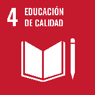
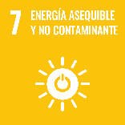
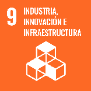

# Ficha Reto 11. Circuitos con mucho arte

**Autoras:** Elena Pascual-Corral, Ana B. Ramos-Gavilán, Ana M.ª Vivar-Quintana y Ana B. González-Rogado

---

All WE are STEAM  
RETOS WE

# FICHA RETO Nº 11 – Circuitos con mucho arte

### Descripción

En este reto se pretende crear circuitos eléctricos en los que se enciendan LEDs de manera muy artística, para lo que se utilizará plastilina conductora y aislante\.

### Enlace al vídeo

```{raw} html
<iframe width="560" height="315" src="https://www.youtube.com/embed/fJRAh_4HIyk" frameborder="0" allowfullscreen></iframe>
```

```{raw} latex
\begin{center}
\textbf{Video:} \url{https://www.youtube.com/watch?v=fJRAh_4HIyk}
\end{center}
```

### Nivel educativo recomendado

La actividad planteada en este reto es adecuada para niveles de Educación Secundaria\. No obstante, puede ser adaptada tanto para Bachillerato como para Educación Primaria siempre que se aumente la complejidad de los circuitos implementados o se simplifique el nivel respectivamente\.

### Contenidos a trabajar

### Representación e interpretación de esquemas eléctricos básicos\.

### Energía eléctrica\. Circuito eléctrico\.

### Ley de Ohm\. Corriente continua\.

### Conocimientos básicos necesarios

Diferenciar materiales aislantes y conductores\.

### Competencias transversales a desarrollar

### Creatividad y originalidad

### Autonomía e iniciativa personal

### Responsabilidad en el desarrollo tecnológico sostenible 

### Materiales o recursos necesarios

Pila de 9V, conector, cables, plastilina conductora, plastilina no conductora, diodos led

__RECETA DE PLASTILINA CONDUCTORA__

- 1 y ½ taza de harina
- 1 taza de agua
- ¼ taza de sal
- 9 cucharadas soperas de limón
- 1 cucharada de aceite vegetal
- Colorante alimentario o pintura acrílica

Se mezclan todos los ingredientes en un cazo \(salvo la media taza de harina\)\. Se enciende el cazo a fuego medio, removiendo los ingredientes constantemente hasta que hierva la mezcla y comience a engrosar\. Se sigue removiendo hasta formar una bola\. Se apaga el fuego y se deja enfriar la masa para poder manipularla\. Una vez fría, se amasa sobre una superficie plana incorporando poco a poco la harina restante hasta que la masa esté firme pero moldeable\.

__RECETA DE PLASTILINA NO CONDUCTORA__

- 1 y ½ taza de harina
- ½ taza de azúcar
- 1 taza de agua destilada
- 3 cucharada de aceite vegetal
- Colorante alimentario o pintura acrílica

Se mezclan todos los ingredientes en un cazo \(salvo la media taza de harina\)\. Se enciende el cazo a fuego medio, removiendo los ingredientes constantemente hasta que hierva la mezcla y comience a engrosar\. Se sigue removiendo hasta formar una bola\. Se apaga el fuego y se deja enfriar la masa para poder manipularla\. Una vez fría, se amasa sobre una superficie plana incorporando poco a poco la harina restante hasta que la masa esté firme pero moldeable\.

Se puede consultar la receta en el siguiente enlace de la Biblioteca Nacional de España:
```{raw} html
<iframe width="560" height="315" src="https://www.youtube.com/embed/dEwh9-5OElQ" frameborder="0" allowfullscreen></iframe>
```

```{raw} latex
\begin{center}
\textbf{Video:} \url{https://www.youtube.com/watch?v=dEwh9-5OElQ}
\end{center}
```

### Otros materiales que se pueden utilizar

- Pueden incorporarse otros materiales aislantes y conductores que se dispongan en el entorno para crear la escultura\.
- Si se desea, en lugar de elaborar la plastilina conductora, podría sustituirse por plastilina comercial, mientras que la plastilina aislante podría sustituirse por arcilla\. 

### Relación con la Agenda 2030

Con este reto se pretende concienciar sobre cómo con una formación STEAM se colabora en la consecución del ODS 4: Educación de calidad; del ODS 7: Energía asequible y no contaminante; y del ODS 9: Industria, innovación e infraestructura\.



ODS 4: Esta actividad sirve para enseñar conceptos básicos de electricidad y circuitos a estudiantes, promoviendo la educación STEAM \(ciencia, tecnología, ingeniería, arte y matemáticas\)\.



ODS 7: A través de la involucración de la plastilina conductora, se introducen de forma creativa y educativa los circuitos eléctricos\. Se puede aprovechar para destacar la importancia de la innovación en la educación para fomentar soluciones de energía asequible y no contaminante\.



ODS 9: A través del uso de la plastilina, también se puede destacar la importancia de la innovación en la creación de circuitos eléctricos de manera accesible y educativa\. Esto puede inspirar a los estudiantes a considerar carreras en ciencia y tecnología, contribuyendo así al desarrollo de infraestructuras y avances tecnológicos\.

A través de la página https://ingenieriaparaods\.usal\.es se puede acceder a material didáctico que facilita el análisis de la situación mundial en relación con los ODS, y permite visibilizar cómo la ingeniería hace posible avanzar en algunas metas\.

### Aspectos que se deben tener en cuenta en la realización del reto

__Seguridad:__

Asegúrate de que los materiales utilizados sean seguros y no representen riesgos eléctricos para quienes participen en la actividad\. Utiliza baterías de baja potencia y asegúrate de que los cables estén bien aislados\.

__Conductividad de la Plastilina:__

Comprueba la conductividad de la plastilina conductora\. Puedes hacerlo probando la conexión con un multímetro\. Asegúrate de que la plastilina es lo suficientemente conductora para permitir el flujo de corriente\.

__Diseño Creativo:__

Fomenta la creatividad al diseñar las figuras artísticas\. Puedes inspirarte en objetos cotidianos, animales o formas abstractas\. Asegúrate de que el diseño permite la conexión de componentes eléctricos de manera coherente\.

__Aislamiento:__

Utiliza plastilina aislante para separar secciones conductoras y prevenir cortocircuitos\. El aislamiento es crucial para garantizar que la corriente fluya solo a través de las áreas deseadas\.

__Componentes Eléctricos:__

Selecciona componentes eléctricos pequeños y seguros que se puedan incorporar a las figuras\. Esto puede incluir luces LED, pequeños motores, zumbadores, etc\. Asegúrate de que estos componentes sean compatibles con la baja potencia de las baterías que estás utilizando\.

__Conexiones Estables:__

Asegúrate de que las conexiones eléctricas sean estables y seguras\. La plastilina conductora debe adherirse bien a los componentes eléctricos y mantener conexiones sólidas sin interrupciones\.

__Experimentación y Aprendizaje:__

Fomenta la experimentación y el aprendizaje a medida que los participantes exploran cómo la electricidad fluye a través de diferentes formas y estructuras\. Esto incluye la comprensión de conceptos como circuitos paralelos y en serie\.

__Reciclaje y Sostenibilidad:__

Considera la posibilidad de utilizar materiales reciclados o sostenibles en el proyecto para fomentar la conciencia ambiental\.

### Otras indicaciones

Para seguir la receta de las plastilinas aislante y conductora puede requerirse la supervisión de un adulto\.

## Agradecimiento

El Ministerio de Igualdad del Gobierno de España, a través del Instituto de las Mujeres financia la actuación RETOS WE, convocatoria PAC 2023 INMUJERES, “All WE are STEAM – Experiencias de aprendizaje planteadas por mujeres ingenieras \(Women Engineers\)”, número de referencia: 31\-4ACT/23\.

