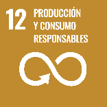

# Ficha Reto 12. Fachadas eficientes

**Autoras:** M.ª Paz Sáez-Pérez, Ana B. Ramos-Gavilán, Ana M.ª Vivar-Quintana y Ana B. González-Rogado

---

All WE are STEAM  
RETOS WE

# FICHA RETO Nº 12 – Fachadas eficientes

### Descripción

Aplicar la eficiencia energética en nuestro entorno es una necesidad que tiene la sociedad en general para conseguir mejores condiciones tanto presentes como futuras\. Este reto nos propone determinar un factor clave en el comportamiento energético de nuestras fachadas y con ello evaluar cuál de ellas en un mismo edificio es más sensible a las condiciones exteriores y por tanto necesita de medidas complementarias para conseguir esas condiciones de eficiencia\.

### Enlace al vídeo

```{raw} html
<iframe width="560" height="315" src="https://www.youtube.com/embed/QGUwQ7MsTdM" frameborder="0" allowfullscreen></iframe>
```

```{raw} latex
\begin{center}
\textbf{Video:} \url{https://www.youtube.com/watch?v=QGUwQ7MsTdM}
\end{center}
```

### Nivel educativo recomendado

Esta actividad es adecuada para Bachillerato, Educación Secundaria o último curso de Educación Primaria\. Para los niveles de Secundaria y Bachillerato, serán los propios estudiantes los que conseguirán la información necesaria para realizar los cálculos, determinarán la orientación de las fachadas y establecerán cuales son las más sensibles y por tanto podrán necesitar de elementos de ayuda para mejorar su comportamiento\.

En el caso de los estudiantes de primaria, se pueden ofrecer los datos directamente para que ellos determinen la relación hueco/fachada y se les indicarán las orientaciones para que ellos dialoguen sobre qué orientación será más o menos eficiente\.

### Contenidos a trabajar

Eficiencia energética, orientación de edificios, condiciones climatológicas en diferentes estaciones, pérdidas de energía, consumos en climatización, medidas para el ahorro energético, tipos de fachadas y materiales\. Con estos conceptos podrán entender cómo se comportan los edificios y qué elementos o actuaciones se podrían aplicar para mejorar su eficiencia\.

### Conocimientos básicos necesarios

No es necesario ningún conocimiento previo 

### Competencias transversales a desarrollar

- Creatividad y originalidad
- Autonomía e iniciativa personal
- Trabajo en equipo
- Toma de decisiones

### Materiales o recursos necesarios

- Plano de localización del edificio \(se puede buscar en google maps\) para indicar las orientaciones\.
- Papel y lápiz para hacer el esquema de la fachada donde se identificarán los huecos, tipo y medida\.
- Cinta métrica
- Brújula \(se puede utilizar la que suelen traer algunos dispositivos móviles o descargarla directamente\)
- Cámara fotográfica \(en caso de no poder medir, por la altura del edificio, se puede determinar la relación hueco/fachada estimando las dimensiones a través de fotografías y la comprobación de algunas medidas reales\)\.

### Otros materiales que se pueden utilizar

Para Primaria:

```{raw} html
<iframe width="560" height="315" src="https://www.youtube.com/embed/Ej_ugAMp30g" frameborder="0" allowfullscreen></iframe>
```

```{raw} latex
\begin{center}
\textbf{Video:} \url{https://www.youtube.com/watch?v=Ej_ugAMp30g}
\end{center}
```
```{raw} html
<iframe width="560" height="315" src="https://www.youtube.com/embed/FUqvuEJj3tM" frameborder="0" allowfullscreen></iframe>
```

```{raw} latex
\begin{center}
\textbf{Video:} \url{https://www.youtube.com/watch?v=FUqvuEJj3tM}
\end{center}
```

Para Secundaria \(últimos cursos\) y Bachillerato

- [https://www\.bbva\.es/finanzas\-vistazo/ef/finanzas\-personales/que\-es\-la\-eficiencia\-energetica\.html](https://www.bbva.es/finanzas-vistazo/ef/finanzas-personales/que-es-la-eficiencia-energetica.html)

Para Bachillerato:

- [https://e\-ficiencia\.com/orientacion\-de\-fachadas\-y\-huecos\-parametros\-eficiencia\-energetica/](https://e-ficiencia.com/orientacion-de-fachadas-y-huecos-parametros-eficiencia-energetica/)
- [https://inditer\.es/blog/como\-calcular\-la\-eficiencia\-energetica/](https://inditer.es/blog/como-calcular-la-eficiencia-energetica/)

### Relación con la Agenda 2030

Con este reto se pretende concienciar sobre cómo la eficiencia energética en edificios contribuye a la reducción de la huella de carbono y fomenta prácticas más sostenibles en el uso de recursos y energía\. Esta rama del conocimiento STEAM colabora en la consecución de los Objetivos de Desarrollo Sostenible:


ODS 7: Energía Asequible y No Contaminante\.


ODS 11: Ciudades y Comunidades Sostenibles\.



ODS 12: Producción y Consumo Responsables\.


ODS 13: Acción por el Clima\.

A través de la página https://ingenieriaparaods\.usal\.es se puede acceder a material didáctico que facilita el análisis de la situación mundial en relación con los ODS, y permite visibilizar cómo la ingeniería hace posible avanzar en algunas metas\.

### Aspectos que se deben tener en cuenta en la realización del reto

Sería una buena oportunidad para abordar los conceptos de ahorro energético, consumo responsable, pérdidas de calor, ventilación, que resultan claves para favorecer el comportamiento de nuestros edificios y que estos sean un poco más eficientes\.

Para alumnos de cursos superiores, también se puede relacionar introduciendo los conceptos de Net Zero Energy Building, Carbon Footprint, Green building, etc\.

### Otras indicaciones

Al ser un tema ampliamente conocido y que afecta a todos, sin tener que ser especialistas para poder proponer medidas de ahorro y eficiencia energética en los edificios, se puede desarrollar también en otras lenguas\.

## Agradecimiento

El Ministerio de Igualdad del Gobierno de España, a través del Instituto de las Mujeres financia la actuación RETOS WE, convocatoria PAC 2023 INMUJERES, “All WE are STEAM – Experiencias de aprendizaje planteadas por mujeres ingenieras \(Women Engineers\)”, número de referencia: 31\-4ACT/23\.

