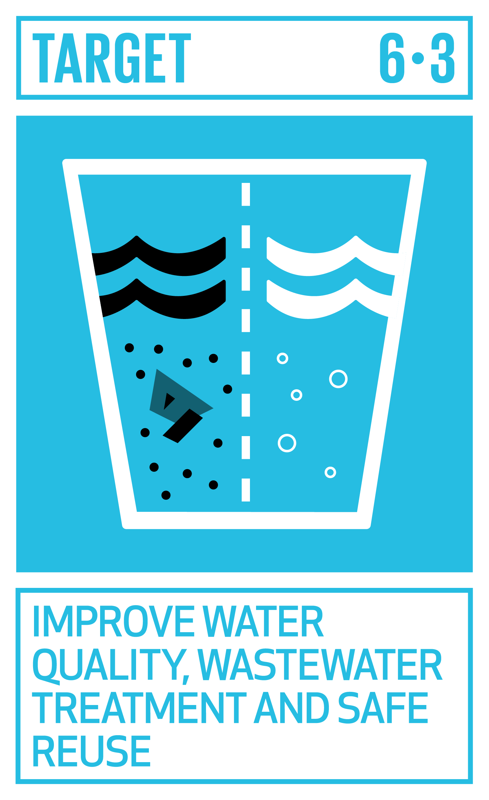
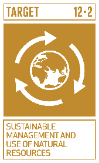
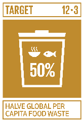
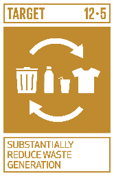
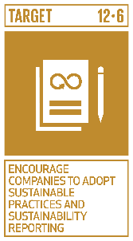
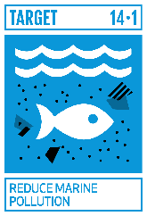

# Ficha Reto 13. ¿Qué sabes de los "subproductos agroalimentarios"?

**Autoras:** Isabel Revilla, Ana B. Ramos-Gavilán, Ana M.ª Vivar-Quintana y Ana B. González-Rogado

---

All WE are STEAM  
RETOS WE

# FICHA RETO Nº 13 – ¿Qué sabes de los “subproductos agroalimentarios”?

### Descripción

Cada vez que se procesa un alimento se generan subproductos que son las partes sólidas o semisólidas que no se emplean de forma directa para la alimentación\. Estos subproductos pueden constituir un gran problema tanto por la cantidad de recursos que se desperdician, algunos de ellos perfectamente comestibles, como por la contaminación que pueden ocasionar\. Este reto os plantea, por un lado, si sabéis si la cantidad de subproductos que se generan en el procesado de alimentos \(verduras\) es grande o pequeña y por otro si sabéis para qué se pueden aprovechar esos subproductos\.

### Enlace al vídeo

```{raw} html
<iframe width="560" height="315" src="https://www.youtube.com/embed/t7GT00qS_LI" frameborder="0" allowfullscreen></iframe>
```

```{raw} latex
\begin{center}
\textbf{Video:} \url{https://www.youtube.com/watch?v=t7GT00qS_LI}
\end{center}
```

### Nivel educativo recomendado

Esta actividad es adecuada para los últimos cursos de Educación Primaria y Primeros de Secundaria\. Sin embargo, si se profundiza en la segunda parte del reto \(alternativas de aprovechamiento\) puede ser adecuada para cursos más altos de Secundaria y Bachillerato\.

### Contenidos a trabajar

Sostenibilidad, en concreto la producción y el consumo responsables y la necesidad de reutilizar los recursos naturales\. Se puede aprovechar para definir la diferencia entre residuo y subproducto y la diferencia entre eliminación y aprovechamiento\.

### Conocimientos básicos necesarios

No es necesario que los alumnos tengan ningún conocimiento básico\. De forma opcional se sugiere que si se va a trabajar en Educación Secundaria se calculen los porcentajes de pérdida por lo que deberían manejar el concepto de porcentaje\.

### Competencias transversales a desarrollar

- Comunicación audiovisual y TIC
- Fomento de la creatividad y del espíritu científico\.

### Materiales o recursos necesarios

- Verduras sin procesar: patatas, zanahorias, guisantes, puerro, judías verdes…
- Cuchillos y recipientes donde recoger materia prima y subproductos
- Báscula
- Ordenador, Tablet o similar para realizar búsquedas\.

### Otros materiales que se pueden utilizar

- Valorización de subproductos en la industria hortofrutícola, materia prima para nuevos procesos productivos\. [https://www\.plataformatierra\.es/innovacion/subproductos\-industria\-hortofruticola\-materia\-prima\-nuevos\-procesos\-productivos](https://www.plataformatierra.es/innovacion/subproductos-industria-hortofruticola-materia-prima-nuevos-procesos-productivos)
- Más alimento, menos desperdicio \(en los hogares páginas 13\-14, en la industria alimentaria páginas 19\-22\)

[https://www\.mapa\.gob\.es/es/alimentacion/temas/desperdicio/13memoria\_estrategia\_mamd\_2020\_0\_tcm30\-627833\.pdf](https://www.mapa.gob.es/es/alimentacion/temas/desperdicio/13memoria_estrategia_mamd_2020_0_tcm30-627833.pdf)

- Catálogo de iniciativas nacionales e internacionales sobre el desperdicio alimentario\. 

[https://www\.mapa\.gob\.es/es/alimentacion/temas/desperdicio/0catalogoiniciativassobredesperdicioalimentario\_2022\_tcm30\-627945\.pdf](https://www.mapa.gob.es/es/alimentacion/temas/desperdicio/0catalogoiniciativassobredesperdicioalimentario_2022_tcm30-627945.pdf)

- Economía circular: qué es, beneficios y ejemplos\.

[https://www\.ecolatras\.es/blog/sostenibilidad/economia\-circular\-que\-es\-beneficios\-y\-ejemplos?gad\_source=2&gclid=EAIaIQobChMI\_ZWi5eqJhAMV0YNQBh0CJworEAEYAyABEgJk4\_D\_BwE](https://www.ecolatras.es/blog/sostenibilidad/economia-circular-que-es-beneficios-y-ejemplos?gad_source=2&gclid=EAIaIQobChMI_ZWi5eqJhAMV0YNQBh0CJworEAEYAyABEgJk4_D_BwE)

### Relación con la Agenda 2030

Con este reto se pretende concienciar sobre cómo con una formación STEAM se colabora en la consecución del ODS 6: Agua limpia y saneamiento; ODS 12: Producción y consumo responsables; y del ODS14: Vida submarina; en las metas:



Meta 6\.3: De aquí a 2030, mejorar la calidad del agua reduciendo la contaminación, eliminando el vertimiento y minimizando la emisión de productos químicos y materiales peligrosos\.



Meta 12\.2: De aquí a 2030, lograr la gestión sostenible y el uso eficiente de los recursos naturales\.



Meta 12\.3: De aquí a 2030, reducir a la mitad el desperdicio de alimentos per cápita mundial en la venta al por menor y a nivel de los consumidores y reducir las pérdidas de alimentos en las cadenas de producción y suministro, incluidas las pérdidas posteriores a la cosecha\.



Meta 12\.5: De aquí a 2030, reducir considerablemente la generación de desechos mediante actividades de prevención, reducción, reciclado y reutilización\.



Meta 12\.6: Alentar a las empresas, en especial las grandes empresas y las empresas transnacionales, a que adopten prácticas sostenibles e incorporen información sobre la sostenibilidad en su ciclo de presentación de informes\.



Meta 14\.1: De aquí a 2025, prevenir y reducir significativamente la contaminación marina de todo tipo, en particular la producida por actividades realizadas en tierra, incluidos los detritos marinos y la polución por nutrientes\.

A través de la página [https://ingenieriaparaods\.usal\.es](https://ingenieriaparaods.usal.es) se puede acceder a material didáctico que facilita el análisis de la situación mundial en relación con los ODS, y permite visibilizar cómo la ingeniería hace posible avanzar en algunas metas\.

### Aspectos que se deben tener en cuenta en la realización del reto

El reto puede ser un punto de partida para explicar el concepto de economía circular\. También se puede aprovechar para definir qué se entiende por sostenibilidad tanto económica como ambiental\.

### Otras indicaciones

Se podría realizar en otras lenguas al menos la primera parte ya que el vocabulario e instrucciones son sencillas\.

## Agradecimiento

El Ministerio de Igualdad del Gobierno de España, a través del Instituto de las Mujeres financia la actuación RETOS WE, convocatoria PAC 2023 INMUJERES, “All WE are STEAM – Experiencias de aprendizaje planteadas por mujeres ingenieras \(Women Engineers\)”, número de referencia: 31\-4ACT/23\.

