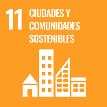

# Reto 15. Cómo identificar si una fachada está bien aislada térmicamente

**Autoras:** M.ª Soledad Camino-Olea, Ana B. Ramos-Gavilán, Ana M.ª Vivar-Quintana y Ana B. González-Rogado

### Descripción

Los edificios deben ser sostenibles de forma que su consumo energético sea nulo\. La fachada como elemento del cerramiento exterior del edificio, que nos separa y aísla del ambiente exterior más frío o más caliente que la temperatura de confort interior, debe ser diseñada y construida de manera que proporcione un buen aislamiento térmico\. 

¿Cómo podemos aproximarnos a conocer el aislamiento térmico de una fachada, por ejemplo, la del aula en la que estudiamos? Midiendo la temperatura en el interior del aula y la temperatura en la superficie de la fachada por el interior en diferentes zonas: enlucido de yeso, alicatado, carpintería, vidrio\. La zona con menor aislamiento térmico será aquella en la que la diferencia entre la temperatura interior y la de la superficie sea mayor\. 

Si se mide la temperatura exterior y la temperatura superficial de la fachada por el exterior, en la misma zona donde se ha medido la temperatura superficial interior, se podría conocer el aislamiento térmico ya que con estos valores se puede estimar la transmitancia térmica\.

### Enlace al vídeo

```{raw} html
<iframe width="560" height="315" src="https://www.youtube.com/embed/rDUQNK5IUiw" frameborder="0" allowfullscreen></iframe>
```

```{raw} latex
\begin{center}
\textbf{Video:} \url{https://www.youtube.com/watch?v=rDUQNK5IUiw}
\end{center}
```

### Nivel educativo recomendado

Esta actividad es adecuada para los cursos de bachillerato, aunque podrían realizarla estudiantes de cursos inferiores con la ayuda del profesorado\.

### Contenidos a trabajar

En invierno, cuando hace frío, al aproximarnos a la superficie interior de la fachada podemos comprobar que está más fría que el interior del local en el que estamos, especialmente la carpintería si es metálica o en los vidrios si son sencillos\. Esta diferencia de temperatura varía en función de la transmitancia del cerramiento, valor que indica lo que aísla térmicamente\. Cuanto mayor sea el aislamiento térmico de una fachada, el valor de la transmitancia será menor y la diferencia entre la temperatura ambiente, en el centro del local, y la temperatura superficial, será también menor\. 

En un día frío de invierno en un local que tenga fachada orientada al norte o que no reciba la radiación del sol directamente, se medirá la temperatura en el centro del local y la temperatura en diversos puntos de la cara interior de la fachada y se anotarán en un croquis que se ha dibujado previamente del alzado interior\. Si esos puntos los señalamos con círculo o cuadrados de diferentes colores: de colores fríos para las diferencias mayores de temperatura a colores cálidos cuando la diferencia es menor, se obtendrá un alzado en la que por colores identificarán los puntos con menor o mayor aislamiento\. Las zonas con menor aislamiento que el resto de la fachada se denominan “puentes térmicos”\. En general: esquinas, perímetros de ventanas, encuentros entre fachada y pilares de la estructura …

### Conocimientos básicos necesarios

Aunque el reto se puede realizar sin tener conocimientos previos, sería aconsejable que los alumnos conociesen el concepto de transmitancia térmica\. 

### Competencias transversales a desarrollar

- Trabajo en equipo
- Iniciativa personal
- Conocimiento de las características de los edificios que habitamos

### Materiales o recursos necesarios

Termómetro para medir la temperatura ambiente y la temperatura superficial\.

### Otros materiales que se pueden utilizar

En los enlaces que se adjuntan se pueden encontrar información relativa a la directiva europea de “eficiencia energética” así como al Plan Nacional Integrado de Energía y Clima, donde podemos conocer las actuaciones relativas a evitar el consumo de energía para preservar el planeta\. También se han adjuntado enlaces a dos documentos de apoyo DA de la normativa española de ahorro de energía DB\-HE que deben cumplir los edificios\. Esta documentación no es necesaria para el desarrollo del reto, se ha adjuntado para los interesados en profundizar en el tema del reto propuesto:

- [Plan Nacional Integrado de Energía y Clima \(PNIEC\) 2021\-2030 \(miteco\.gob\.es\)](https://www.miteco.gob.es/es/ministerio/planes-estrategias/plan-nacional-integrado-energia-clima.html) 
- [https://eur\-lex\.europa\.eu/legal\-content/ES/TXT/PDF/?uri=CELEX:32018L0844](https://eur-lex.europa.eu/legal-content/ES/TXT/PDF/?uri=CELEX:32018L0844)	
- [\(Microsoft Word \- DA\-DB\-HE\-1 \- C\\341lculo de par\\341metros caracter\\355sticos\_conRadiacionSolar\_enero2020\.docx\) \(codigotecnico\.org\)](https://www.codigotecnico.org/pdf/Documentos/HE/DA_DB-HE-1_Calculo_de_parametros_caracteristicos_de_la_envolvente.pdf) 
- [DA\-DB\-HE\-2 \- Condensaciones \(codigotecnico\.org\)](https://www.codigotecnico.org/pdf/Documentos/HE/DA-DB-HE-2_-_Condensaciones.pdf)

### Relación con la Agenda 2030

Con este reto se pretende concienciar sobre cómo con una formación STEAM se colabora en la consecución de los Objetivos de Desarrollo Sostenible:


ODS 3: Salud y bienestar\.



ODS 11: Ciudades sostenibles\.

A través de la página https://ingenieriaparaods\.usal\.es se puede acceder a material didáctico que facilita el análisis de la situación mundial en relación con los ODS, y permite visibilizar cómo la ingeniería hace posible avanzar en algunas metas\.

### Aspectos que se deben tener en cuenta en la realización del reto

Podría ser una oportunidad para introducir a los estudiantes en conocimientos relativos a la construcción de la fachada de los edificios, los materiales aislantes térmicos, los vidrio dobles y triples, las carpinterías con rotura de puente térmico, los elementos de sombreado, para que conozcan mejor los edificios en los que habitan y están preparados para un futuro sostenible en el que los edificios no consuman menos energía y sean más saludables\.

### Otras indicaciones

Se podría realizar una charla explicativa a los estudiantes antes de acometer el reto e informarles de los conceptos necesarios y desarrollar algún ejemplo\.
