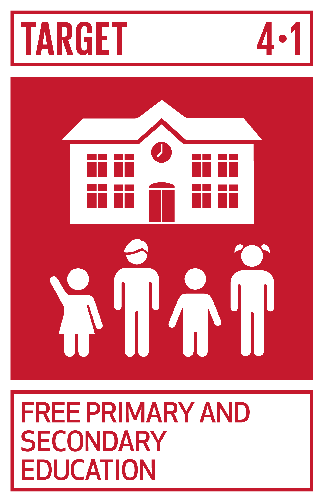
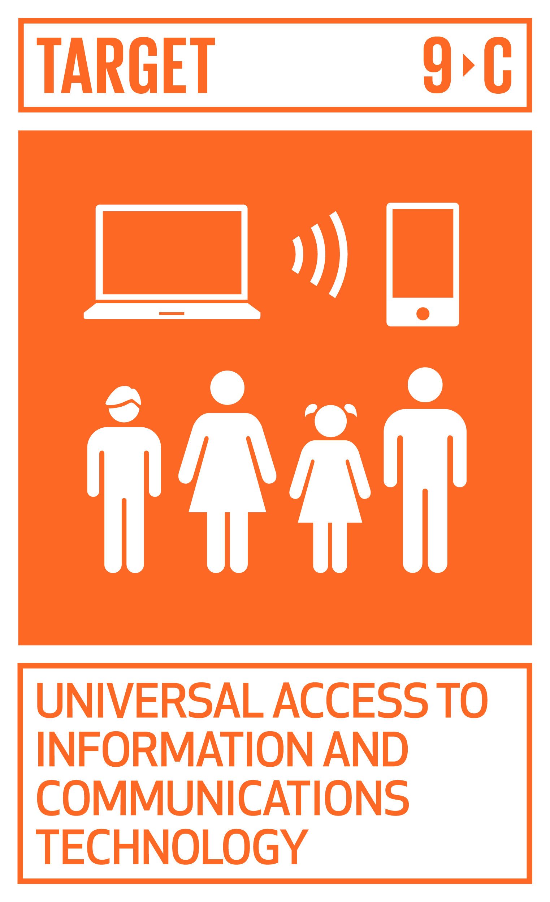

# Ficha Reto 16. ¿Cuánto ocupa el sonido?

**Autoras:** Ana B. González-Rogado, Ana M.ª Vivar-Quintana y Ana B. Ramos-Gavilán

---

ALL WE are STEAM  
RETOS WE

# FICHA RETO Nº 16 – ¿Cuánto ocupa el sonido?

### Descripción

El video presenta de forma somera cómo se digitaliza el sonido para almacenarlo en un sistema informático\. El reto planteado busca que se calcule el tamaño de un archivo de sonido \(sin comprimir y en Mbytes\) que almacene la voz de una persona leyendo un texto durante 1 minuto\.

El reto integra conocimientos de ciencia, matemáticas y tecnología, fomentando el pensamiento crítico, la resolución de problemas y la aplicación práctica de conceptos científicos en el mundo real\.

Para hacer el reto hay que utilizar algún dispositivo que mida la frecuencia de la voz, por ejemplo, el sensor de tono de la APP [Arduino Science Journal](https://www.arduino.cc/education/science-journal)

### Enlace al vídeo

```{raw} html
<iframe width="560" height="315" src="https://www.youtube.com/embed/e0Nq0od7dvM" frameborder="0" allowfullscreen></iframe>
```

```{raw} latex
\begin{center}
\textbf{Video:} \url{https://www.youtube.com/watch?v=e0Nq0od7dvM}
\end{center}
```

### Nivel educativo recomendado

El reto está indicado para Educación Primaria\. 

### Contenidos a trabajar

1. __Matemáticas__: Multiplicación y potencias
2. __Tecnología__: Digitalización del sonido: convertir una onda continua en una forma discreta para su almacenamiento en el ordenador\. Conocer el concepto de muestreo y entender cómo se toman muestras de la amplitud de la onda sonora\. 

### Conocimientos básicos necesarios

Multiplicación y manejo de potencias\.

### Competencias transversales a desarrollar

1. __Pensamiento Lógico__: Tomar decisiones lógicas sobre la cantidad de muestras, el tamaño de la muestra y el número de canales basándose en principios científicos y tecnológicos\.
2. __Habilidades Tecnológicas: __Utilizar herramientas tecnológicas como programas de grabación de audio y aplicaciones móviles para recopilar datos sobre la propia voz\.
3. __Habilidades de Investigación__: Realizar investigaciones sobre el proceso de digitalización del sonido, el teorema de Nyquist y la utilización de sensores para medir la frecuencia vocal\.

### Materiales o recursos necesarios

Se necesita un dispositivo móvil, teléfono o tableta, con la aplicación [Arduino Science Journal ](https://www.arduino.cc/education/science-journal)instalada\. 

### Otros materiales que se pueden utilizar

- Acelerómetro, giroscopio\.\.\. todos los sensores que tiene tu teléfono móvil y para qué sirven: [https://www\.xatakandroid\.com/tutoriales/acelerometro\-giroscopio\-todos\-sensores\-que\-tiene\-tu\-telefono\-movil\-sirven](https://www.xatakandroid.com/tutoriales/acelerometro-giroscopio-todos-sensores-que-tiene-tu-telefono-movil-sirven) 
- Science Journal\. Convierte tu móvil en un laboratorio\. Observatorio de tecnología educativa nº 22: [https://intef\.es/observatorio\_tecno/science\-journal\-convierte\-tu\-movil\-en\-un\-laboratorio/](https://intef.es/observatorio_tecno/science-journal-convierte-tu-movil-en-un-laboratorio/)
- Inspire the future generation of scientists: [https://www\.arduino\.cc/education/science\-journal](https://www.arduino.cc/education/science-journal) 
- Making Experiments with the Arduino Science Journal:
```{raw} html
<iframe width="560" height="315" src="https://www.youtube.com/embed/uJ-rsGWkWto" frameborder="0" allowfullscreen></iframe>
```

```{raw} latex
\begin{center}
\textbf{Video:} \url{https://www.youtube.com/watch?v=uJ-rsGWkWto}
\end{center}
```

### Relación con la Agenda 2030

Con este reto se pretende concienciar sobre cómo con una formación STEAM se colabora en la consecución del ODS 4: Educación de calidad; del ODS 5: Igualdad de género; y del ODS 9: Industria, Innovación e infraestructuras; en las metas:



Meta 4\.1: Asegurar la calidad de la educación primaria y secundaria\.


Meta 5\.B: Mejorar el uso de tecnología y TIC\.



Meta 9\.C\. Aumento del acceso a TIC e Internet\.

A través de la página [https://ingenieriaparaods\.usal\.es](https://ingenieriaparaods.usal.es) se puede acceder a material didáctico que facilita el análisis de la situación mundial en relación con los ODS, y permite visibilizar cómo la ingeniería hace posible avanzar en algunas metas\.

### Aspectos que se deben tener en cuenta en la realización del reto

Este reto busca presentar a las y los estudiantes en el proceso de transformación de la información del mundo real al mundo digital\. Y fomenta la comprensión de conceptos científicos a través del uso un dispositivo que se utiliza a diario, pero que del que desconocen los sensores que tiene y su utilidad en todos los ámbitos\.

### Otras indicaciones

Ninguna\.

## Agradecimiento

El Ministerio de Igualdad del Gobierno de España, a través del Instituto de las Mujeres financia la actuación RETOS WE, convocatoria PAC 2023 INMUJERES, “All WE are STEAM – Experiencias de aprendizaje planteadas por mujeres ingenieras \(Women Engineers\)”, número de referencia: 31\-4ACT/23\.

